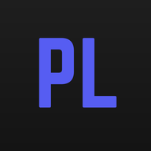
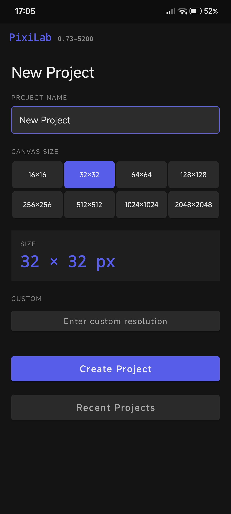
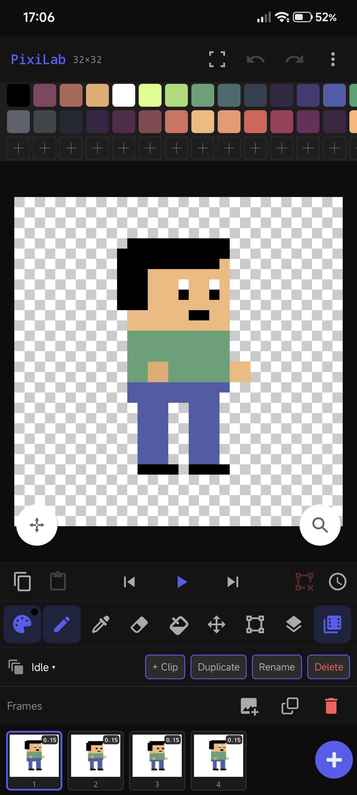
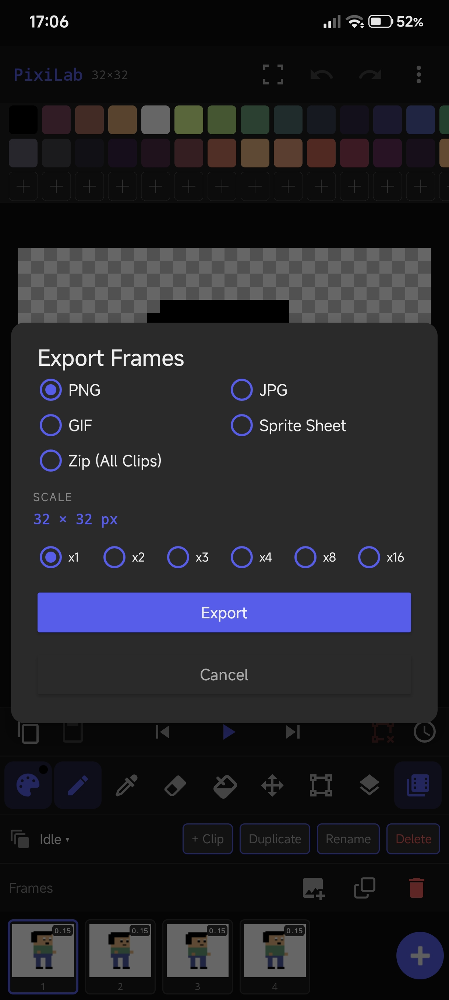
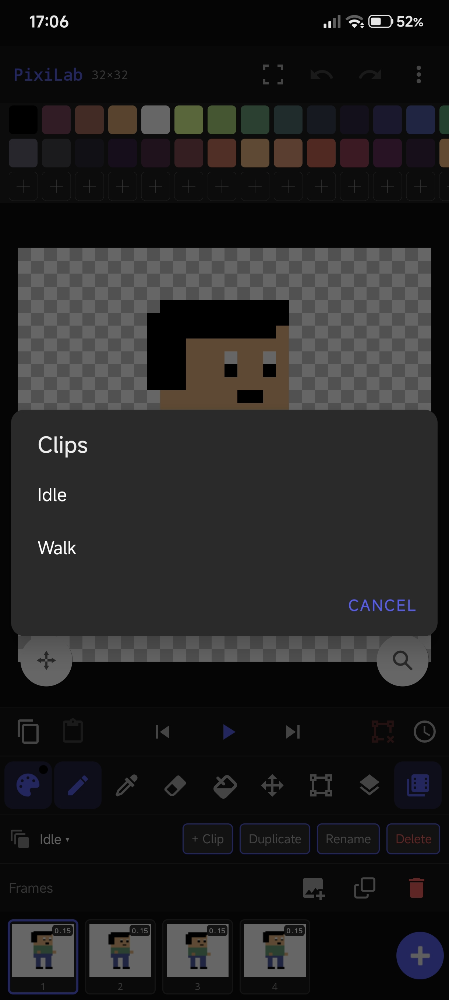
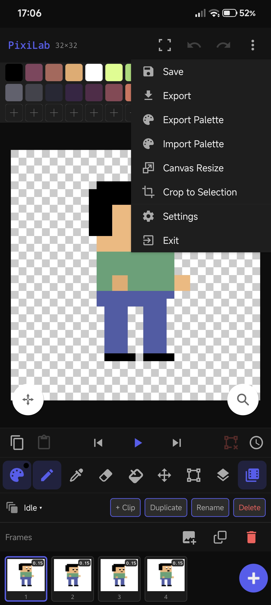
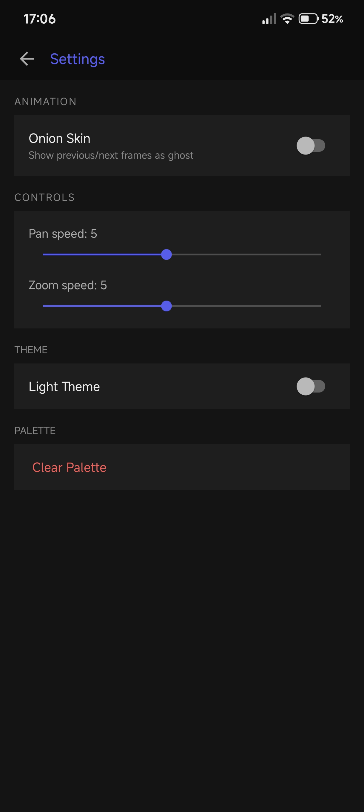

  

<h1 align="center">PixiLab</h1>

  A feature-rich, intuitive Pixel Art and Frame-by-Frame Animation editor. Built with a focus on a smooth mobile workflow, it provides all the essential tools for creating sprites, tilesets, and retro animations directly on your device.

---

## ✨ Features

### 🛠️ Advanced Workspace & Tools
* **Essential Toolset:** Pencil, Eraser, Bucket Fill, and Color Picker (Eyedropper).
* **Advanced Selection:** Selection tools, Crop to Selection, and Canvas Resizing on the fly.
* **Symmetrical Design:** Mirror drawing modes (Horizontal & Vertical) for faster character creation.
* **Palette Management:** Easily create, add, import, export, or clear color palettes.

### 🎬 Frame-by-Frame Animation
* **Clip Management:** Organize different animation sets (such as *Idle* or *Walk*) within the same project.
* **Timeline Controls:** Playback controls, frame duplication, custom frame duration, renaming, and easy deletion.
* **Onion Skinning:** Toggle ghost layers of previous and next frames for smooth animation planning.

### 📦 Pro Export Options
* **Multiple Formats:** Export your artwork as **PNG**, **JPG**, **GIF** animations, or optimized **Sprite Sheets**.
* **Pixel-Perfect Upscaling:** Scale your exports from **x1 up to x16** to keep your art crisp on high-resolution screens.
* **Batch Export:** Save and compress all clips into a single **ZIP archive** in one click.

---

## 📱 Screenshots

  
  
  

  
  
  

---

## ⚙️ Configuration & Settings

* **Custom Preferences:** Adjust drawing grid resolutions (16x16, 32x32, up to 2048x2048 or fully custom bounds).
* **UI Themes:** Seamlessly switch between Light and Dark themes.
* **Control Sliders:** Fully customizable Pan and Zoom speeds for a comfortable drawing experience.
* **Recent Projects:** Quick-access dashboard to manage and reload your recent files instantly.
